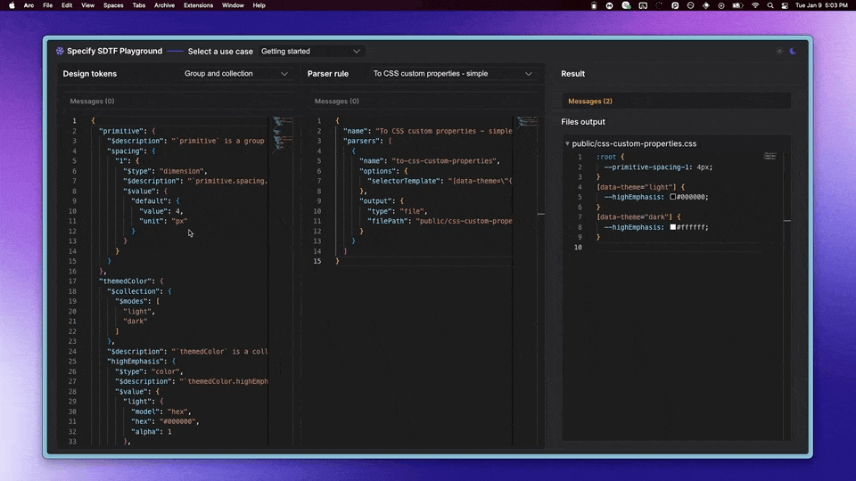

# Playground

## Introduction

The Specify Playground helps you run parsers against a token graph and see the generated output in live. It's a great tool to help you iterate on your configuration files or try new parsers on the go.

[https://iframe.specifyapp.com/sdtf-playground/index.html](https://iframe.specifyapp.com/sdtf-playground/index.html)

<figure><figcaption></figcaption></figure>

## Usage

* The left side panel contains the SDTF graph you'll run your rules against. It's editable and you're free to use your own SDTF graph which you can get with the [to-sdtf](parsers/to-sdtf.md) parser.
* The middle panel contain your rules
* The right side panel displays the generated code
