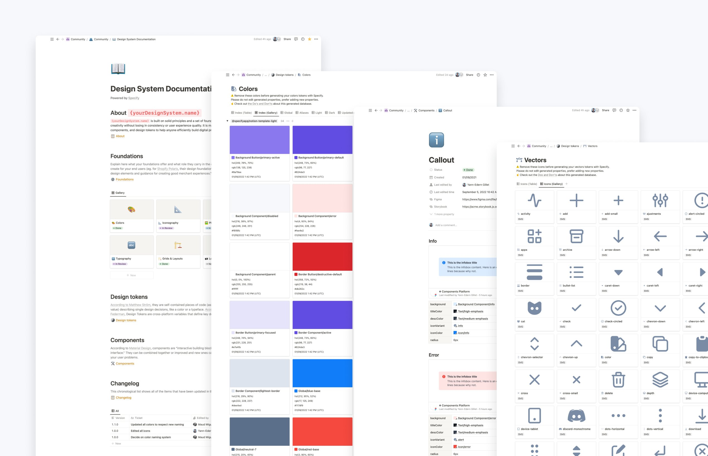
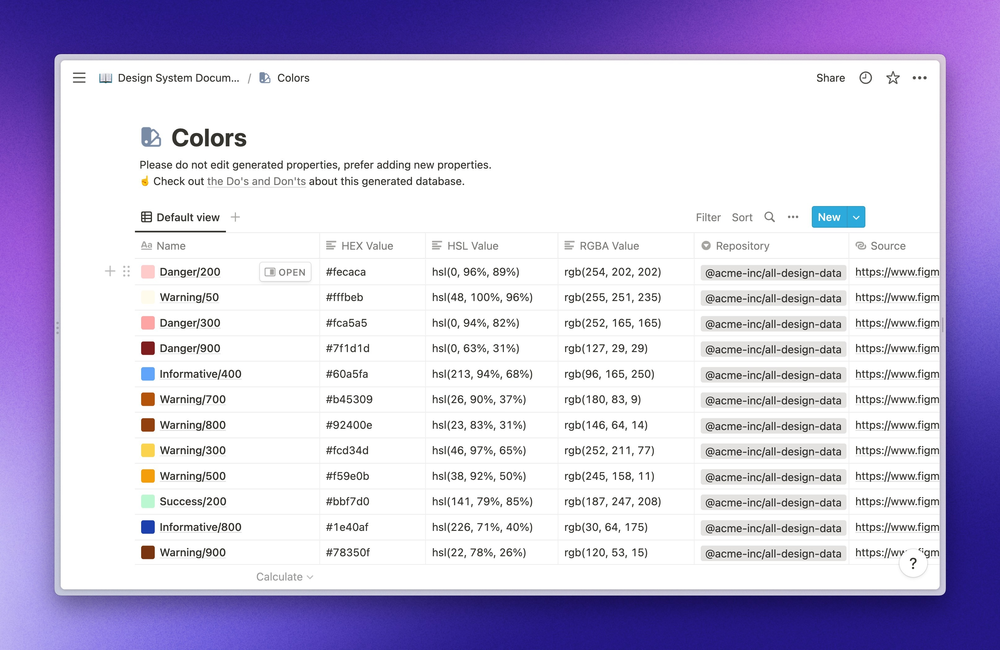
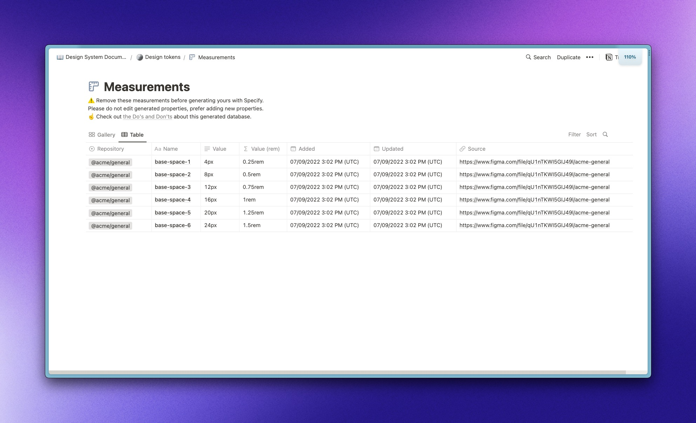
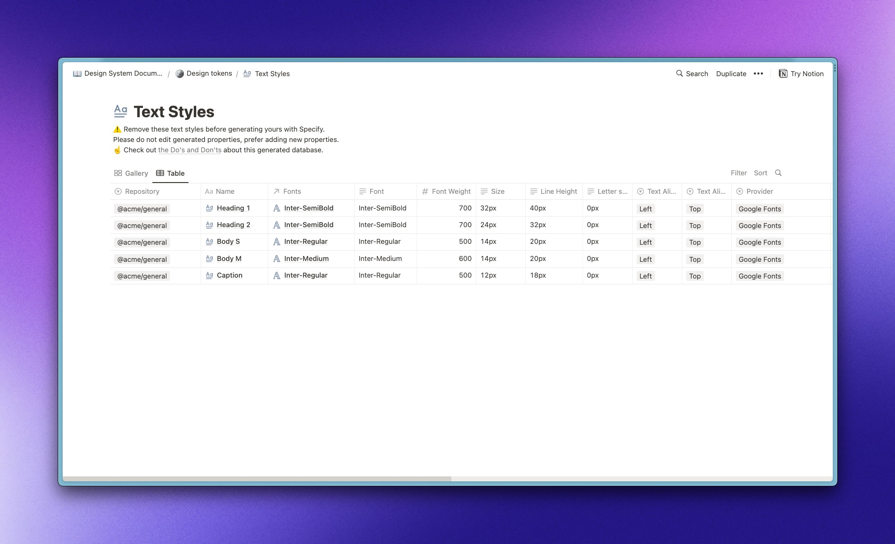
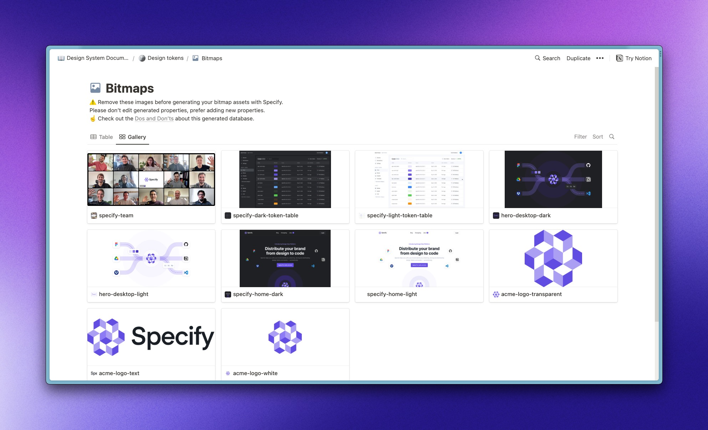
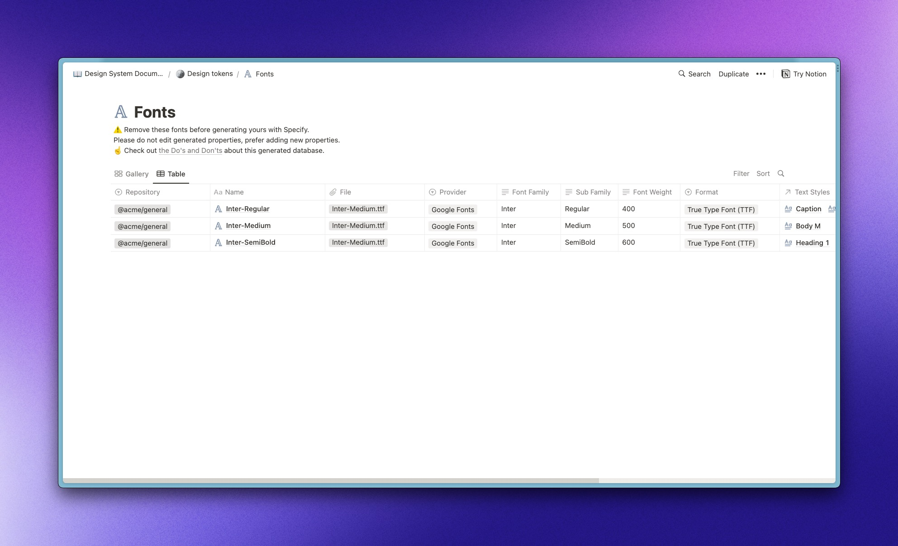
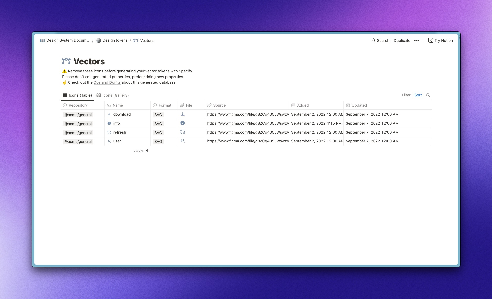

# Notion

<figure><figcaption></figcaption></figure>

## Introduction

Use our Notion integration to:

* Document your brand guidelines
* Create public pages for press and brand kits
* Automate the maintenance of your design system documentation

## Prerequisites

Please make sure you have:

* A Notion account
* A Specify account
* A Specify repository containing some design tokens and/or assets


Want to connect a Notion page from your Notion workspace? Please make sure you have the correct access rights. Otherwise, you'll need for an owner to approve your installation request.


## Supported Token types

You can sync the following [Token types](../concepts/token-types.md) in Notion:

* color
* measurement
* textStyle
* bitmap
* font
* vector

<figure><figcaption></figcaption></figure>

 

<figure><figcaption></figcaption></figure>

 

<figure><figcaption></figcaption></figure>

 

<figure><figcaption></figcaption></figure>

 

<figure><figcaption></figcaption></figure>

 

<figure><figcaption></figcaption></figure>

## Installation


