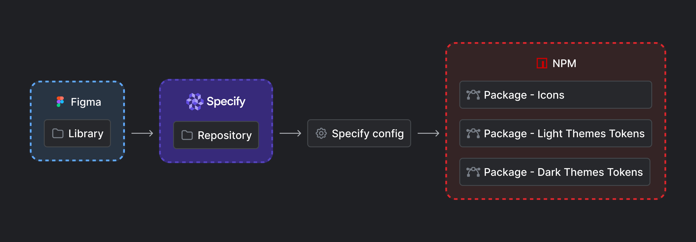
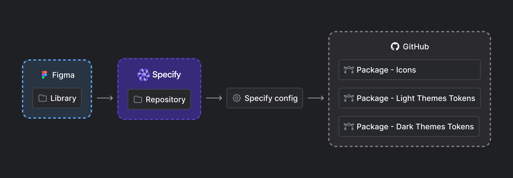

# npm

## Workflow

This integration helps you generate design tokens and assets as private or public packages in a npm or a GitHub registry.

<figure><figcaption>
Workflow to distribute design tokens from a source (i.e Figma) as npm packages 
</figcaption></figure>

<figure><figcaption>
Workflow to distribute design tokens from a source (i.e Figma) as GitHub packages 
</figcaption></figure>

### Choose npm if...

Choose npm if you already have a private npm registry, we suggest you distribute your npm packages there. It will prevent you from creating a public npm package that will take an unnecessary public namespace.


Also, [removing a public npm package has consequences](https://docs.npmjs.com/unpublishing-packages-from-the-registry), so make sure your package needs to be public before making it as is 👍


### Choose GitHub if...

Choose GitHub if you want to keep your packages private to your GitHub organization without paying for an npm team account.

### Choose a custom registry if...

Choose a custom registry if your company uses its own registry. If you have specific security constraints like IP whitelisting or custom authentication.

## Prerequisites

Please make sure you have:

* An npm account, a GitHub account, or access to a custom registry
* A Specify account
* A Specify repository containing some design tokens and/or assets

## Installation

1. Go to your Specify repository you want to distribute your design tokens from
2. Go to the "Destinations" page and click on "Create pipeline"
3. Select "npm packages"
4. Select your existing npm app, or create a new one by setting your [npm](https://docs.npmjs.com/creating-and-viewing-access-tokens) or [GitHub](https://github.com/settings/tokens) personal access token, then set your registry
5. Configure your package name, access type (public / private), and module type (Common JS / ES Modules)
6. Set your Specify configuration file. If you host your config file on an external service like JSONBIN make sure to make your BIN public ([See example](https://api.jsonbin.io/v3/b/6475e9868e4aa6225ea69ba8)). Also, your config only needs the [rules](../concepts/configuration.md#rules) property.

## Useful resources

* [GitHub Packages Documentation](https://docs.github.com/en/packages)
* [npm Docs](https://docs.npmjs.com/)
