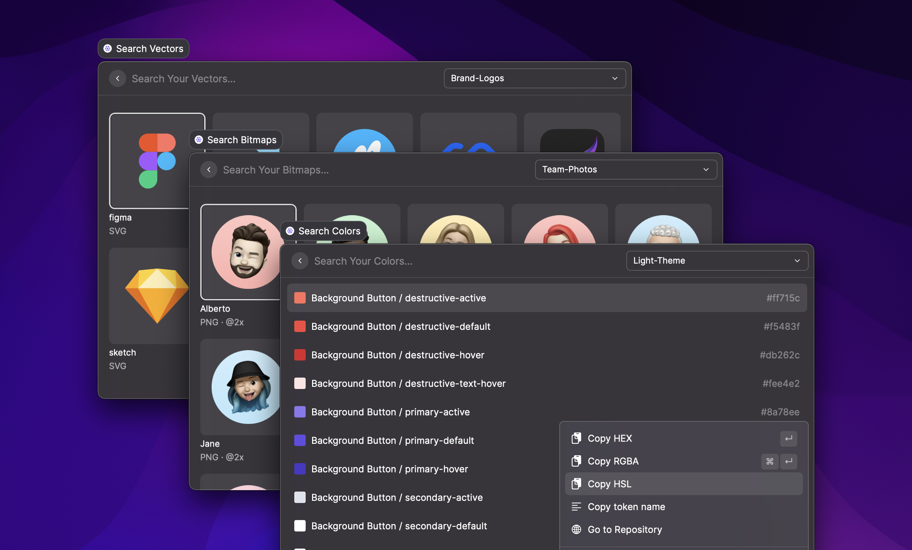
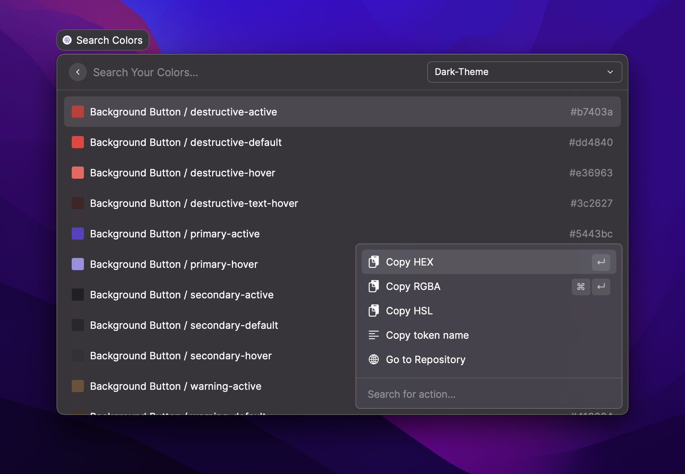

# Raycast

<figure><figcaption></figcaption></figure>

Our Raycast extension helps you search your design tokens and assets and use them in your favorite tools: Notion pages, Pitch presentations, Slack discussions, etc.

## Prerequisites

Please make sure you have:

* [Raycast](https://raycast.so/) installed
* A Specify account
* A Specify repository containing some design tokens and/or assets
* Generated a Personal Access Token for Raycast


Need a personal access token? [Generate one ↗](https://specifyapp.com/user/personal-access-tokens)


## Supported Token types

You can sync the following [Token types](../usage/token-types.md) in Raycast:

* color
* bitmap
* vector

## Installation

1. Install the Specify Raycast extension from the Raycast store
2. Set your newly created Personal Access Token in Raycast

<figure><figcaption></figcaption></figure>

## Usage

### Search colors

<figure><figcaption></figcaption></figure>

Are you looking for a specific color from your design system? Open Raycast and type in `Search Colors`.

The main action is to copy the hexadecimal value of your color. You can also access other actions like copying the value in RGBA or the name of the color by accessing the action menu via `Cmd + K`.

### Search bitmaps

<figure><figcaption></figcaption></figure>

Are you looking for a `.jpg` or `.png` file, such as a logo or photo of a team member? As with the previous search, open Raycast and type in `Search Bitmaps`.

### Search vectors

<figure><figcaption></figcaption></figure>

Are you looking for a `.svg` file, such as a logo or an icon? Just open Raycast and type in `Search Vectors`.
