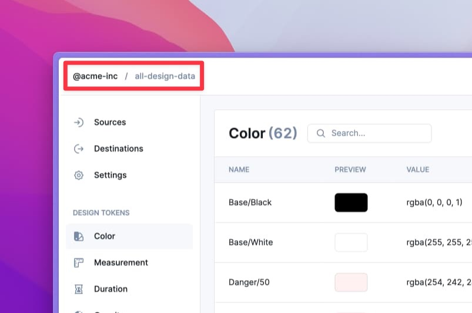

# Configuration

## Introduction

By default, without any [parsers](parsers.md), Specify returns your design data as raw data:

* Design tokens are returned in JSON
* Assets are returned as files

A configuration file helps you:

1. request design tokens and assets from a Specify `repository`
2. transform them to fit your company standards thanks to rules, token types and parsers.



## Properties

A configuration is composed of 3 main properties:

* `repository`
* `personalAccessToken`
* `rules`

### `repository`

The name of the Specify repository you want to pull your design tokens and assets from.

Let's say we have the following repository in Specify called "all-design-data" located in the "@acme-inc" organization.

<figure><figcaption><p>An example Specify repository called "all-design-data" located in the "@acme-inc" organization.</p></figcaption></figure>

We target it like this:



<pre class="language-javascript" data-title=".specifyrc.js" data-line-numbers><code class="lang-javascript">module.exports = {
<strong>  repository: '@acme-inc/all-design-data',
</strong>  personalAccessToken: '&#x3C;your-personal-access-token>',
  rules: [],
};
</code></pre>



<pre class="language-json" data-title=".specifyrc.json" data-line-numbers><code class="lang-json">{
<strong>  "repository": "@acme-inc/all-design-data",
</strong>  "personalAccessToken": "&#x3C;your-personal-access-token>",
  "rules": []
}
</code></pre>




You can only target one repository per configuration file. Want to pull design tokens from several Specify repositories? Create a several configuration files and run them with the Specify CLI.


### `personalAccessToken`

The Specify `personalAccessToken` used to authenticate your actions.


Need a personal access token? [Generate one ↗](https://specifyapp.com/user/personal-access-tokens)




<pre class="language-javascript" data-line-numbers><code class="lang-javascript">module.exports = {
  repository: '@workspace/repository',
<strong>  personalAccessToken: '&#x3C;your-personal-access-token>',
</strong>  rules: [],
};
</code></pre>



<pre class="language-json" data-line-numbers><code class="lang-json">{
  "repository": "@workspace/repository",
<strong>  "personalAccessToken": "&#x3C;your-personal-access-token>",
</strong>  "rules": []
}
</code></pre>



### `rules`

Rules help you transform your design tokens and assets the way you want.

You can have as many rules as you want and you can have rules that transform several [Token types](token-types.md) at once.

A rule is composed of the following properties:

```typescript
interface Rule {
  name: string;
  path: string;
  filter?: {
    types: Array<TokenType>
  };
  parsers?: Array<Parser>;
};
```

| Name      | Type                                                                                                                                          | Required                                  | Description                                                                                                                                                                                                                                                                                                                                                                                      |
| --------- | --------------------------------------------------------------------------------------------------------------------------------------------- | ----------------------------------------- | ------------------------------------------------------------------------------------------------------------------------------------------------------------------------------------------------------------------------------------------------------------------------------------------------------------------------------------------------------------------------------------------------ |
| `name`    | `string`                                                                                                                                      | <mark style="color:yellow;">`true`</mark> | The name of your rule.                                                                                                                                                                                                                                                                                                                                                                           |
| `path`    | `string`                                                                                                                                      | <mark style="color:yellow;">`true`</mark> | <p>The path in your project where you want Specify to generate your design data.</p><p>If you want to pull <a href="token-types.md#bitmap">bitmap</a>, <a href="token-types.md#vector">vector</a> or <a href="token-types.md#font">font</a> token types you must set a directory (<a href="https://github.com/Specifyapp/parsers/tree/master/parsers/convert-font#output">Learn more ↗</a>).</p> |
| `filter`  | <pre class="language-typescript" data-overflow="wrap"><code class="lang-typescript">Record&#x3C;'types', Array&#x3C;TokenType>>
</code></pre> | <mark style="color:red;">`false`</mark>   | The list of [Token type](token-types.md) you want your rule to target.                                                                                                                                                                                                                                                                                                                           |
| `parsers` | `Array<Parser>`                                                                                                                               | <mark style="color:red;">`false`</mark>   | The parsers you want to apply to transform your [Token types](token-types.md). For further details see [Parsers](https://specifyapp.com/developers/configuration#heading-parsers).                                                                                                                                                                                                               |

#### Parsers

Parsers are functions allowing you to transform design tokens and assets coming from Specify to fit your needs and company standards.

Inside a configuration, a parser has the following properties:

```typescript
interface Parser {
  name: string;
  options?: Record<string, any>;
}
```

| Name      | Type                                                                                                  | Required                                  | Description                                                                                                                 |
| --------- | ----------------------------------------------------------------------------------------------------- | ----------------------------------------- | --------------------------------------------------------------------------------------------------------------------------- |
| `name`    | `string`                                                                                              | <mark style="color:yellow;">`true`</mark> | The name of the parser. Choose from [all available parsers](parsers.md#all-parsers-available).                              |
| `options` | <pre class="language-typescript"><code class="lang-typescript">Record&#x3C;string, any>
</code></pre> | <mark style="color:red;">`false`</mark>   | The options relative to the parser you apply. Each parser has its own options you can find in their respective README file. |

#### Example

Here's a rule named "Design Tokens" that:

1. targets `color` and `measurement` design tokens
2. sorts them alphabetically by their `name`
3. transforms them as CSS Custom Properties
4. writes them in a `design-tokens.css` file inside a `styles` folder




```javascript
[
  {
    name: 'Design Tokens',
    path: 'styles/design-tokens.css',
    filter: {
      types: ['color', 'measurement']
    },
    parsers: [
      {
        name: 'sort-by',
        options: {
          keys: ['name']
        }
      },
      {
        name: 'to-css-custom-properties'
      }
    ]
  },
]
```





```json
[
  {
    "name": "Design Tokens",
    "path": "styles/design-tokens.css",
    "filter": {
      "types": ["color", "measurement"]
    },
    "parsers": [
      {
        "name": "sort-by",
        "options": {
          "keys": ["name"]
        }
      },
      {
        "name": "to-css-custom-properties"
      }
    ]
  }
]
```




## Examples

### How to run these examples

The following examples are made to be used with the Specify CLI.

Requirements:

* a Specify repository containing design tokens
* a valid personal access token ([Generate one ↗](https://specifyapp.com/user/personal-access-tokens))

Run all examples by copying the code and running the `specify pull` command.

### Basic

Here's a basic configuration file that targets a Specify repository called `all-design-data` from the `@acme-inc` organization:




```javascript
module.exports = {
  repository: '@acme-inc/all-design-data',
  personalAccessToken: '<your-personal-access-token>',
  rules: [
    {
      name: 'All design tokens in JSON',
      path: 'design-tokens.json',
      parsers: [],
    },    
  ],
};
```





```json
{
  "repository": "@acme-inc/all-design-data",
  "personalAccessToken": "<your-personal-access-token>",
  "rules": [
    {
      "name": "All design tokens in JSON",
      "path": "design-tokens.json",
      "parsers": []
    }
  ]
}
```




The generated `design-tokens.json` has the following content:


An example file containing all possible token types pulled from a Specify repository


### Pull colors as CSS Custom Properties

Now let's update our previous configuration to only pull colors and transform them as CSS Custom Properties in HSL.




```javascript
module.exports = {
  repository: '@acme-inc/all-design-data',
  personalAccessToken: '<your-personal-access-token>',
  rules: [
    {
      name: 'All design tokens in JSON',
      path: 'colors.css',
      filter: {
        types: ['color']
      },
      parsers: [
        {
          name: 'to-css-custom-properties',
          options: {
            formatTokens: {
              color: 'hsl'
            },
          },
        },
      ],
    },
  ],
};
```





```json
{
  "repository": "@acme-inc/all-design-data",
  "personalAccessToken": "<your-personal-access-token>",
  "rules": [
    {
      "name": "Colors as CSS Custom Properties",
      "path": "colors.css",
      "filter": {
        "types": ["color"]
      },
      "parsers": [
        {
          "name": "to-css-custom-properties",
          "options": {
            "formatTokens": {
              "color": "hsl"
            }
          }
        }
      ]
    }
  ]
}
```




Here is the input returned by Specify and the output generated by Specify after executing our configuration.




```json
[
  {
    "name": "Primary/100",
    "value": {
      "a": 1,
      "b": 254,
      "g": 233,
      "r": 237
    },
    "type": "color",
    "description": ""
  },
  {
    "name": "Primary/200",
    "value": {
      "a": 1,
      "b": 254,
      "g": 214,
      "r": 221
    },
    "type": "color",
    "description": ""
  },
  {
    "name": "Primary/300",
    "value": {
      "a": 1,
      "b": 253,
      "g": 181,
      "r": 196
    },
    "type": "color",
    "description": ""
  }
]
```





```css
:root {
  /* COLOR */
  --primary-100: hsl(251, 91%, 95%);
  --primary-200: hsl(251, 95%, 92%);
  --primary-300: hsl(252, 95%, 85%);
}
```



