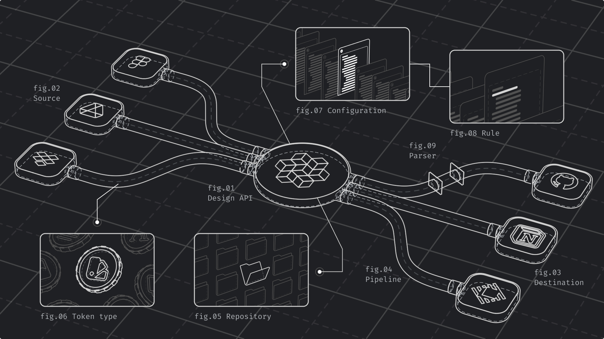

# Concepts

<figure><figcaption></figcaption></figure>

### Design API

A Design API is an API designed to help you synchronize information within your design system such as design tokens, assets, components and even documentation.

### Source

A source is a place that contains data you want to sync within your design system. Like a Figma file from which you sync your colors from. Or a GitHub repository containing your design tokens in JSON.

### Destination

A destination is a place in which you distribute data in. Like a GitHub repository consuming colors coming from your design system or a Notion database in which you document your icons.

### Pipeline

A pipeline is the route that connects a Source or a Destination to Specify. It helps you transform and synchronize data (e.g., design tokens) within your design system.

### Repository

A repository is like a folder containing your design tokens and assets in Specify. Use repositories to store and organize your design data.

### Token type

A Token type is a type of design token or asset supported by Specify like a colors, a text style or an icon. [See all token types](../usage/token-types.md).

### Configuration

By default Specify returns design tokens and assets in JSON. Configure it to generate design data compatible with your company standards (e.g., CSS Variables).

### Rule

A rule is a part of your configuration that helps you transform one or several Token types the way you want. Like a rule to pull colors from Specify as CSS Variables in a CSS file.

### Parser

Parsers are functions allowing you to transform design tokens and assets coming from Specify to fit your needs and company standards. [See all parsers](../usage/parsers.md#all-parsers-available).
