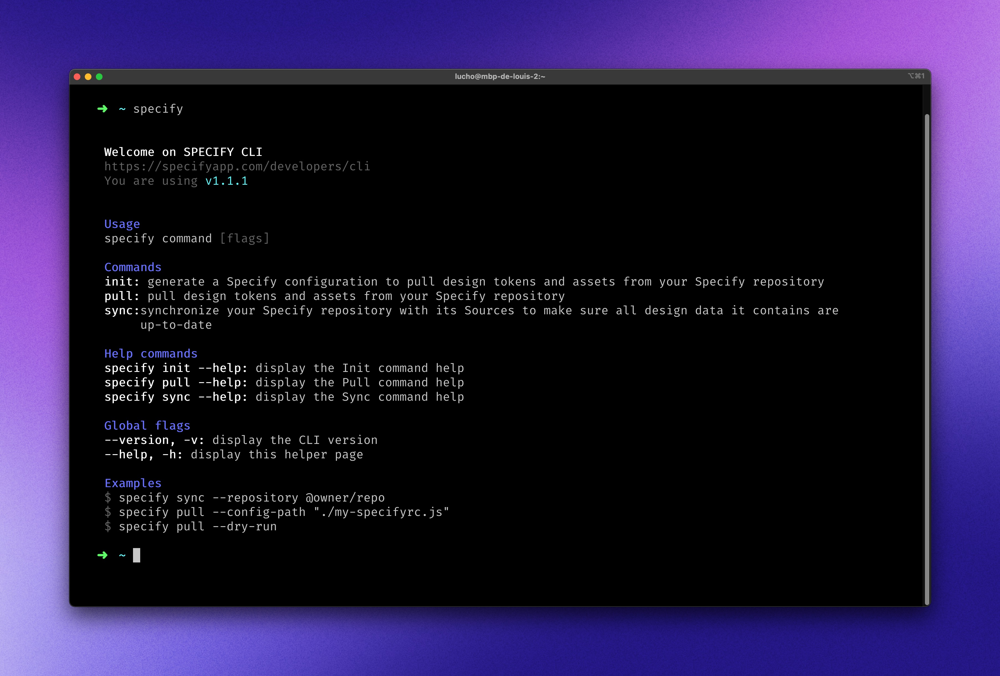

# CLI

<figure><figcaption></figcaption></figure>

## Introduction

Use the Specify CLI to integrate Specify in your workflow.

You can use the Specify CLI to:

* Pull your design tokens in the right format using parsers
* Test your configuration before using it in a GitHub repository
* Sync a Specify repository

### Installation

Install `@specifyapp/cli` via npm or Yarn.



```bash
npm install -g @specifyapp/cli
```



```bash
yarn global add @specifyapp/cli
```



## Commands

### Sync

Sync a Specify repository to update its design tokens and assets.

```bash
specify sync [flags]
```

### Init

Initialize a Specify configuration tailored for a specific output format. [See all configuration templates](broken-reference).

```bash
specify init
```

### Pull

Pull design tokens and assets from your Specify repository.

```bash
specify pull [flags]
```

## Flags

Flags are parameters you can pass while launching the command. All of these parameters are optional if you use a config file.

#### -C, --config-path

Relative path to your Specify config file.

#### -r, --repository

The name of the Specify repository you want to pull your design tokens and assets from.

#### -p, --personal-access-token

The Specify Personal Access Token used to authenticate your actions.


Need a personal access token? [Generate one ↗](https://specifyapp.com/user/personal-access-tokens)


#### -R, --rules

Rules Specify will follow to generate design tokens and assets in your desired output format.

#### --dry-run

Execute command without actually writing files. Use this flag to test the output of a configuration without generating files.
