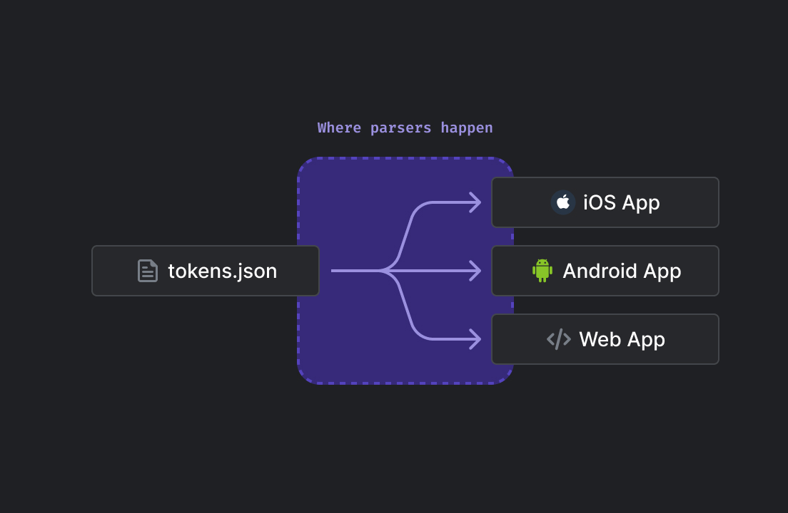

# Parsers

## Why you need parsers

<figure><figcaption>
Parsers help you transform raw design tokens and assets returned by Specify to match your company standards
</figcaption></figure>

By default, without any parsers, Specify will return your design data as raw data:

* Design tokens are returned in JSON
* Assets are returned as files

There are high chances you need to transform those design data to fit your needs. Parsers help you do just that.

## What are parsers?

Parsers are functions allowing you to transform design tokens and assets coming from Specify to fit your needs and company standards.

<figure><figcaption>
An example output pipeline that pulls colors from Specify, sorts them alphabetically and transforms them as CSS Custom Properties
</figcaption></figure>

A parser does the following job:

1. Receives design data as input
2. Transforms this design data
3. Returns the transformed data

The data returned by a parser can either be:

* Design data that can be used by another parser coming next in your transformation pipeline
* A file so it can be used by people, frameworks, or scripts


Parsers are what make Specify powerful and flexible. They help you be in total control of the design data you pull from Specify.


Parsers are ordered and takes specific input to generate specific output. This way, we can easily test the input coming from the previous parser to check if the whole parsers process will work.

## Categories

Parsers are classified in 2 categories: technology and utility.

### Technology

Technology parsers help you transform your design tokens to specific technologies and formats (CSS Custom properties, SCSS, Tailwind, a Javascript theme object compatible with React Native...)

Some examples:

* [to-react-native](https://github.com/Specifyapp/parsers/tree/master/parsers/to-react-native)
* [to-css-custom-properties](https://github.com/Specifyapp/parsers/tree/master/parsers/to-css-custom-properties)
* [to-scss-variables](https://github.com/Specifyapp/parsers/tree/master/parsers/to-scss-variables)
* [to-tailwind](https://github.com/Specifyapp/parsers/tree/master/parsers/to-tailwind)

### Utility

Utility parsers take care of "smaller" transformation. Like converting a pixel value to \`rem\` or transforming a string to kebabcase.

Some examples:

* [convert-font](https://github.com/Specifyapp/parsers/tree/master/parsers/convert-font)
* [kebabcasify](https://github.com/Specifyapp/parsers/tree/master/parsers/kebabcasify)
* [px-to-rem](https://github.com/Specifyapp/parsers/tree/master/parsers/px-to-rem)

## All parsers available

All parsers are open source and available on [the following GitHub repository](https://github.com/Specifyapp/parsers).

| Name                                                                                                                   | Description                                                                                                                                                                                                                                  |
| ---------------------------------------------------------------------------------------------------------------------- | -------------------------------------------------------------------------------------------------------------------------------------------------------------------------------------------------------------------------------------------- |
| [camelcasify](https://github.com/Specifyapp/parsers/tree/master/parsers/camelcasify)                                   | Apply camelcase function on specific keys from a design token.                                                                                                                                                                               |
| [convert-font](https://github.com/Specifyapp/parsers/tree/master/parsers/convert-font)                                 | Convert font files in several formats: `woff2`, `woff`, `otf`, `ttf`, `eot`.                                                                                                                                                                 |
| [filter](https://github.com/Specifyapp/parsers/tree/master/parsers/filter)                                             | Filter design tokens and assets by their name using a regular expression.                                                                                                                                                                    |
| [inline-css-variables-in-svg](https://github.com/Specifyapp/parsers/tree/master/parsers/inline-css-variables-in-svg)   | Replace hardcoded design token values in a SVG string by their corresponding CSS Custom Property.                                                                                                                                            |
| [kebabcasify](https://github.com/Specifyapp/parsers/tree/master/parsers/kebabcasify)                                   | Apply kebabcase function on specific keys from a design token.                                                                                                                                                                               |
| [link-design-tokens](https://github.com/Specifyapp/parsers/tree/master/parsers/link-design-tokens)                     | Have design tokens referencing other ones. It replaces absolute values by their potential corresponding design token.                                                                                                                        |
| [name-assets-files-by-pattern](https://github.com/Specifyapp/parsers/tree/master/parsers/name-assets-files-by-pattern) | Set a structured filename on your assets. It won't rename your asset but only add a new `filename` property on the asset object. The filename structure uses [mustache](https://github.com/janl/mustache.js#templates) as a template engine. |
| [omit](https://github.com/Specifyapp/parsers/tree/master/parsers/omit)                                                 | Omit keys from a design token not given in parameters.                                                                                                                                                                                       |
| [pascalcasify](https://github.com/Specifyapp/parsers/tree/master/parsers/pascalcasify)                                 | Apply pascalcase function on specific keys from a design token.                                                                                                                                                                              |
| [pick](https://github.com/Specifyapp/parsers/tree/master/parsers/pick)                                                 | Get only specific keys from a design token given in params.                                                                                                                                                                                  |
| [px-to-rem](https://github.com/Specifyapp/parsers/tree/master/parsers/px-to-rem)                                       | Convert the value of a Measurement design token from pixel to rem.                                                                                                                                                                           |
| [prefix-by](https://github.com/Specifyapp/parsers/tree/master/parsers/prefix-by)                                       | Prefix a string or a whole file by a string.                                                                                                                                                                                                 |
| [replace-string](https://github.com/Specifyapp/parsers/tree/master/parsers/replace-string)                             | Replace any string matched by a regex by a new string.                                                                                                                                                                                       |
| [round-number](https://github.com/Specifyapp/parsers/tree/master/parsers/round-number)                                 | Round any measurement design token with specific precision.                                                                                                                                                                                  |
| [snakecasify](https://github.com/Specifyapp/parsers/tree/master/parsers/snakecasify)                                   | Apply snakecase function on specific keys from a design token.                                                                                                                                                                               |
| [sort-by](https://github.com/Specifyapp/parsers/tree/master/parsers/sort-by)                                           | Loop on several design tokens and sort them according to their respective key values.                                                                                                                                                        |
| [suffix-by](https://github.com/Specifyapp/parsers/tree/master/parsers/suffix-by)                                       | Concatenate two strings.                                                                                                                                                                                                                     |
| [svg-to-jsx](https://github.com/Specifyapp/parsers/tree/master/parsers/svg-to-jsx)                                     | Wrap SVG files within a JSX component.                                                                                                                                                                                                       |
| [svgo](https://github.com/Specifyapp/parsers/tree/master/parsers/svgo)                                                 | Optimize vectors using [svgo](https://github.com/svg/svgo).                                                                                                                                                                                  |
| [to-css-custom-properties](https://github.com/Specifyapp/parsers/tree/master/parsers/to-css-custom-properties)         | Transform design tokens in CSS Custom Properties.                                                                                                                                                                                            |
| [to-css-font-import](https://github.com/Specifyapp/parsers/tree/master/parsers/to-css-font-import)                     | Create CSS `@font-face` rules to import your font files.                                                                                                                                                                                     |
| [to-css-text-style](https://github.com/Specifyapp/parsers/tree/master/parsers/to-css-text-style)                       | Create text styles as CSS classes.                                                                                                                                                                                                           |
| [to-dsp](https://github.com/Specifyapp/parsers/tree/master/parsers/to-dsp)                                             | Create a [Design System Package (DSP)](https://github.com/AdobeXD/design-system-package-dsp).                                                                                                                                                |
| [to-jss](https://github.com/Specifyapp/parsers/tree/master/parsers/to-jss)                                             | Transform design tokens in JSS.                                                                                                                                                                                                              |
| [to-flutter](https://github.com/Specifyapp/parsers/tree/master/parsers/to-flutter)                                     | Transform design tokens for Flutter.                                                                                                                                                                                                         |
| [to-react-native](https://github.com/Specifyapp/parsers/tree/master/parsers/to-react-native)                           | Transform design tokens to a JavaScript theme object compatible with [React Native](https://reactnative.dev/).                                                                                                                               |
| [to-scss-map](https://github.com/Specifyapp/parsers/tree/master/parsers/to-scss-map)                                   | Generate `.scss` files containing Scss map and function / mixin to access the values of the tokens.                                                                                                                                          |
| [to-scss-mixin-text-style](https://github.com/Specifyapp/parsers/tree/master/parsers/to-scss-mixin-text-style)         | Create text styles formatted as [SCSS mixins](https://sass-lang.com/documentation/at-rules/mixin).                                                                                                                                           |
| [to-scss-variables](https://github.com/Specifyapp/parsers/tree/master/parsers/to-scss-variables)                       | Transform design tokens in SCSS variables.                                                                                                                                                                                                   |
| [to-style-dictionary](https://github.com/Specifyapp/parsers/tree/master/parsers/to-style-dictionary)                   | Generate [Style Dictionary](https://amzn.github.io/style-dictionary/#/) configuration files for all your design tokens coming from Specify.                                                                                                  |
| [to-tailwind](https://github.com/Specifyapp/parsers/tree/master/parsers/to-tailwind)                                   | Create a theme compatible with the [TailwindCSS specification](https://tailwindcss.com/docs/theme). The theme is also compatible with [WindiCSS](https://windicss.org/).                                                                     |
| [to-theme-ui](https://github.com/Specifyapp/parsers/tree/master/parsers/to-theme-ui)                                   | Create a theme compatible with the [theme-ui specification](https://theme-ui.com/theme-spec).                                                                                                                                                |
